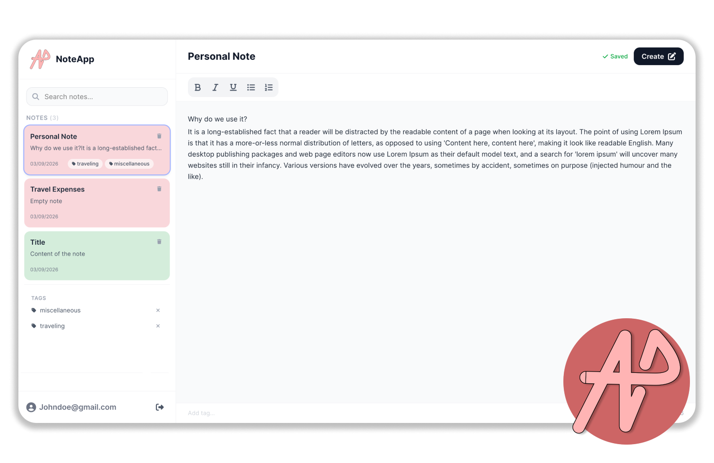
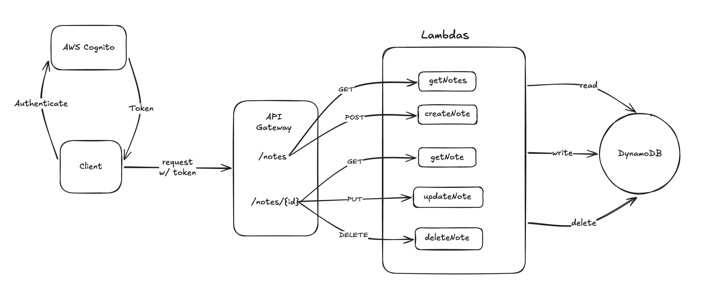

# NoteApp
<p align="center">
  
</p>


A note-taking app built with React, TypeScript, and AWS serverless. Users authenticate, create and edit rich-text notes, organize them with tags, and have changes automatically saved to DynamoDB through a Lambda-backed REST API.

## Features

- Basic Rich-text editor with bold, italic, underline, and lists
- Auto-save with debounced writes
- Colored note cards sorted by last edited
- Tagging system with sidebar filtering and search
- Offline detection with local queueing and automatic sync on reconnect

## High-Level Architecture




The client is a React single-page application built with Vite and styled with Tailwind. All application state lives in Zustand stores in browser memory. The Amplify SDK handles authentication directly with a Cognito User Pool, and the resulting ID token is attached as a Bearer header on every API request.

API Gateway sits in front of five Lambda functions — create, read (list and single), update, and delete — each scoped to a single DynamoDB table partitioned by user ID and sorted by note ID. A Cognito authorizer on API Gateway validates the token before any Lambda executes. Lambdas are stateless and DynamoDB is the only persistent store.

## User Flow & Data Flow

The user signs up with an email and password, confirms via a verification code, and signs in. On login, the client gets redirected to the dashboard and all notes for the authenticated user are fetched from the API as a JSON array.

Creating a note adds it to the local store immediately with a temporary ID, then sends it to the server in the background. Once the server responds, the temp ID is swapped for the real one. Editing triggers on every keystroke, marks the note as "dirty", and a debounce batches multiple events into a single save. Deleting removes the note from the UI instantly and fires the API call in the background. All data travels as JSON. Note content is stored as an HTML string produced by the editor.

## Design Choices

This is a fully authenticated app — every page sits behind an auth guard, and no public content needs search-engine indexing. That makes server-side rendering unnecessary. Therefore using Vite provides fast builds, simple configuration, and no server runtime to deploy or maintain processes.

API calls are routed through Lambda rather than made directly from the browser. This keeps DynamoDB credentials and IAM roles entirely server-side. If the client called AWS services directly, credentials would need to be embedded in the bundle or fetched at runtime — both which are exposure risks. Instead, the client only knows the API Gateway URL, which is a public endpoint gated by Cognito authentication. Lambda executes with its own IAM role, and user identity is resolved server-side from the JWT claim, never trusted from the client payload.

Sensitive configuration like the Cognito User Pool ID and App Client ID is fetched at runtime by the Amplify SDK from a config file, opposed to being baked into environment variables that ship in the build artifact. This matters because anything prefixed with `VITE_` is statically replaced at build time and visible in the production JavaScript bundle. By keeping auth config in a runtime-loaded JSON file and resolving tokens through Cognito's SDK, credentials stay in memory only for the duration of the session and are never embedded in source.

## Client Caching & Network Strategy

All note data lives in an in-memory Zustand store. There is no localStorage, IndexedDB, or service worker cache. Notes are fetched once when the dashboard mounts, and subsequent reads come from memory.

Cache invalidation is implicit: any edit marks the note dirty, and the debounced save pushes the latest snapshot to the server. There is no background polling or revalidation because the client treats its own state independently until the next full page load. This keeps Lambda invocations low since edits are batched into one save per quiet second, and only dirty notes trigger network requests.

## Network Error Handling

The app listens to browser connectivity events and tracks online status reactively. When the user goes offline, a banner appears at the top of the screen and all API calls are suppressed. For the best user experience, users can still create, edit, and delete notes, as those changes are queued locally as pending events are created, dirty edits are stored, and pending deletes. When connectivity restores, the app detects the transition and flushes all queued changes sequentially: pending creates first, then dirty updates, then deletes. There is no exponential backoff or retry cap— failed flushes remain queued for the next online transition. Conflict resolution is last-write-wins; if local state has diverged from the server, the client's version overwrites on the next save.

## State Management

The note store is the single source of truth for all note data. It owns the notes list, the active note selection, sync status, loading and error states, and three internal maps that track pending creates, temporary edits, and pending deletes. Updates come from two directions: user actions (typing, creating, deleting) and API responses (ID reconciliation, dirty-flag clearing). UI states like sidebar visibility, search query, and selected tag lives in a separate store. Auth state lives in its own store as well.

The UI is optimistic. Notes appear, update, and disappear before the server confirms. If a save fails, the sync indicator shows an error that auto-dismisses, but the note stays in its local state with no rollback. The user can continue editing, and the next debounce cycle will retry.

## To get Started

```bash
git clone <repo-url> && cd note-app
npm install
```

Create a `.env` file from `.env.example` and set your API Gateway endpoint:

```bash
# VITE_API_ENDPOINT=https://<api-id>.execute-api.<region>.amazonaws.com/<stage>
```

Place your Amplify configuration in `src/amplifyconfiguration.json` with your Cognito User Pool ID, App Client ID, and region—automatically generated from:

```bash
# amplify pull --appID xxxxxxxx --envName xxxxxx
```
 
Then start the dev server:

```bash
# npm run dev
```

The backend requires five Lambda functions:
- **getNotes—** fetch all notes created by the user.
- **postNote—** create a note.
- **getNote—** fetch a note based on its ID.
- **putNote—** update a note based on its ID.
- **deleteNote—** update a note based on its ID.

These function are deployed behind an API Gateway with a Cognito authorizer. Each Lambda needs a `NOTES_TABLE` environment variable pointing to your DynamoDB table. Auth is managed by a Cognito User Pool configured through Amplify CLI.

## Known Issues & Future Improvements

- **Rich text storage:** Content is currently stored as raw HTML strings. A structured format—eg: TipTap JSON AST, would decouple storage from the editor.
- **Pagination:** All notes are returned in a single query. Including pagination would scale properly.
- **Rich Text Editor:** The textarea and markdown parser was displaying raw syntax instead of formatted text—TipTap was used to replace the textarea and markdown parser.

## Development Log

- **Planning:** Defined the architecture, data model, and component tree. Set up Vite, Tailwind, Zustand, Amplify SDK, and React Router.
- **Auth flow:** Built login, sign-up, and email confirmation forms wired to Cognito.
- **Dashboard & editor:** Built the sidebar with search, colored note cards, and a text editor. 
- **Database:** Built the DynamoDB table to store the notes.
- **API Gateway:** Built the API Gateway to serve REST API requests to the Lambda functions.
- **Lambda handlers:** Built five handlers with input validation, error handling, and CORS headers on every response path.
- **Deployment:** Deployed the backend to AWS using Amplify CLI.

--------------------------------

<p align="center">
Authored by Koffison V.
</p>